# 15 Best Web Scraping Browsers You Should Know About

---

In today's data-driven world where information equals power, web scraping has become an essential tool. Whether you're a researcher analyzing trends, a business owner monitoring competitors, or someone just looking for specific data, browser-based web scraping platforms offer a simple and fast way to extract data from websites without complex coding or technical expertise.

The beauty of browser-based platforms is how they make web scraping accessible to everyone, regardless of technical skill level. These tools provide intuitive interfaces and straightforward functionality that simplify the entire scraping process. No need to be a coding wizard—just point, click, and extract.

Browser-based solutions come with features like data validation, automation, and scheduling that streamline the scraping process and save valuable time. They often have robust proxy networks too, ensuring reliable and secure data extraction while bypassing restrictions or blocking systems.

Let's explore the top browser-based web scraping platforms that can help you unlock the vast amounts of data available online.

## 1. Bright Data

Bright Data stands out as a comprehensive solution for all your web scraping needs. Using a browser-based approach, Bright Data enables you to scrape websites with dynamic content, JavaScript rendering, and complex page architectures, ensuring all important data gets collected.

With Bright Data's Scraping Browser, you can effortlessly navigate target websites while Bright Data handles the entire proxy and unblocking infrastructure on your behalf. The powerful automatic unblocking features of Web Unlocker are integrated into Scraping Browser, creating an automated browser specifically designed for data scraping.

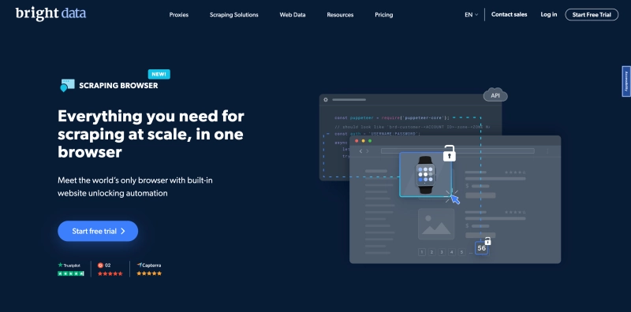

It's perfect for any data scraping project requiring scalability, browser automation, and complete control of website unblocking activities. By using Scraping Browser with Puppeteer and Playwright APIs, it becomes a flexible tool for automating operations and retrieving data from websites.

When handling large volumes of data, this functionality is incredibly handy. Most importantly, Bright Data has implemented anti-blocking methods that let you bypass CAPTCHAs and other types of website blocks.

Its extensive proxy network includes over 72+ million residential IPs and 2 million mobile IPs from around the world, providing unmatched coverage and reliability for web scraping. Additionally, it's compatible with many programming languages including Python, Node.js, and Java, as well as widely-used data storage and analysis systems like AWS, Google Cloud, and BigQuery.

👉 [Discover how this powerful scraping solution can transform your data collection workflow](https://www.scraperapi.com/?fp_ref=coupons)

**Pricing:** Starting from $13.50/GB

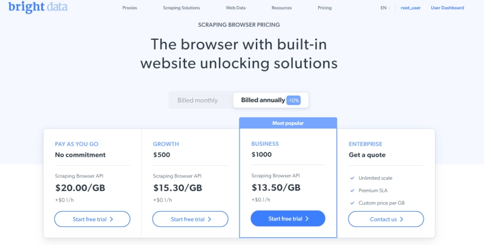

## 2. Octoparse

Octoparse is an ideal browser-based tool specifically created for web scraping. Even people without coding skills can use it for a smooth scraping experience.

With its user-friendly visual scraping tools, you can easily collect data from websites. No need to learn complex coding or scripting languages. By letting you interact directly with websites and select the data pieces you want to extract, Octoparse simplifies the entire process.

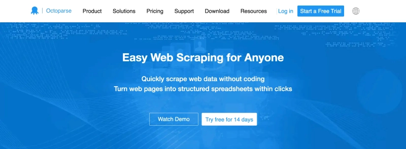

But Octoparse does more than just extract data. It also has excellent data transformation and cleaning capabilities. After scraping data, Octoparse lets you format and enhance it according to your unique needs. You can clean messy data, eliminate duplicates, and even perform complex transformations to make the data more valuable and actionable.

With Octoparse, you can manage every stage of the data lifecycle—extraction, cleaning, and transformation—all using a simple browser-based interface.

**Pricing:** Free plan available, premium pricing starts at $89/month

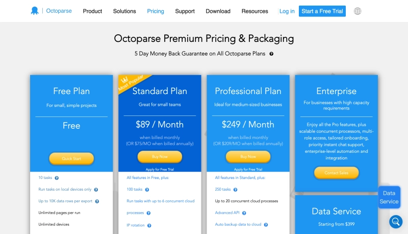

## 3. ParseHub

ParseHub is a flexible and user-friendly platform that meets all your scraping needs. Whether you're a novice or an expert data enthusiast, ParseHub has you covered. What makes ParseHub unique is its simple point-and-click interface, which makes collecting data from dynamic websites much easier.

You don't need to be an expert coder to navigate complex web pages. Just select the data you need, and ParseHub handles the rest. It's like having your own personal data extraction assistant.

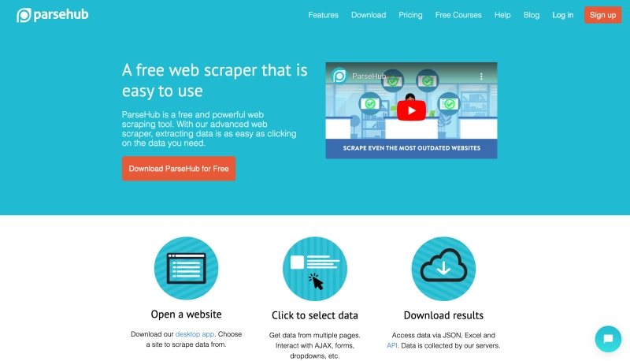

ParseHub offers advanced options that take your scraping to the next level. You can automate the scraping process using scheduled scraping, which allows ParseHub to retrieve data at predetermined intervals, ensuring you always have the latest information.

Additionally, ParseHub provides seamless API connections, letting you easily incorporate scraped data into your own programs or systems. This is an effective technique for optimizing the use of your extracted data and improving your data workflows.

**Pricing:** Free plan available, premium pricing starts at $189/month

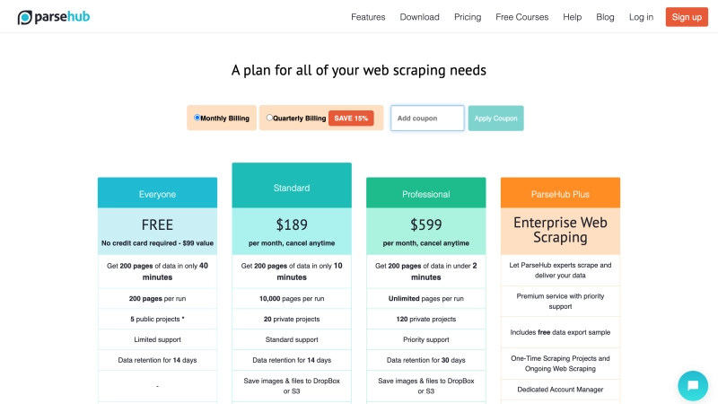

## 4. Webz.io

Webz.io – Big Web Data is an exceptional browser-based technology focused on extracting and monitoring web data. Using Webz.io, you can easily access insightful online data to stay in tune with the web's pulse. This platform is a goldmine of information, providing deep coverage of news stories, blog posts, and online conversations across various topics.

Webz.io ensures you can access the latest and relevant information from across the entire web, regardless of your business or area of expertise. It's like having access to a massive knowledge base.

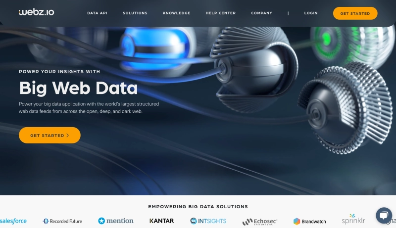

Beyond just data coverage, Webz.io also provides smooth API connections, allowing you to easily incorporate extracted data into your own programs or systems. With this capability, there are countless opportunities to use the data in ways that best meet your needs.

The Webz.io API connection simplifies the data integration process, whether you're creating custom dashboards, conducting market research, or developing AI-driven solutions.

**Pricing:** Contact vendor for pricing details

## 5. Import.io

Import.io is a fantastic browser-based tool with a simple point-and-click interface that eliminates the difficulties of web scraping. Regardless of your data expertise level, web scraping with import.io is straightforward. With just a few clicks and no technical experience required, you can easily extract data from websites.

It's like having a magic wand that collects the data you want from the vast web.

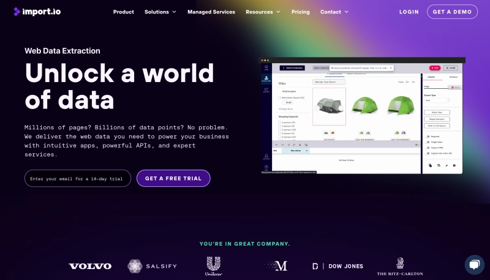

Import.io goes beyond simple extraction with its advanced crawling technology. It can now discover data structures and patterns on web pages, which improves the efficiency and accuracy of the web scraping process. It's like having a data detective familiar with website layouts who can quickly and easily collect the right data.

Thanks to import.io's extensive data integration capabilities, scraped data can also be exported in various formats and programs. Import.io can provide the data you need in CSV, Excel, or JSON format. Retrieved data can be simply incorporated into your databases, analytics programs, or even business applications.

**Pricing:** 14-day free trial, premium pricing starts at $199/month

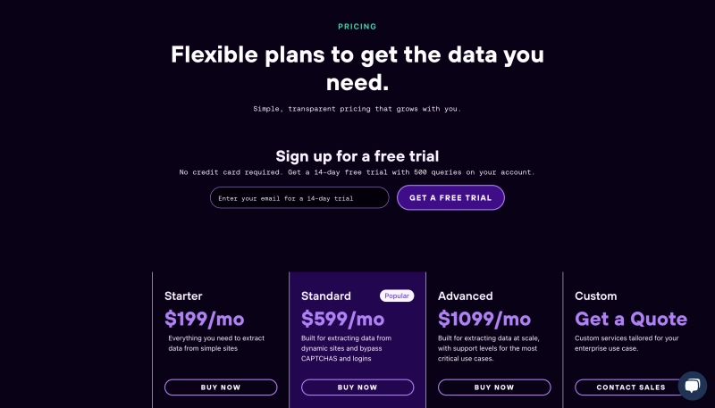

## 6. Dexi.io

Dexi.io is an innovative platform that works in your browser and offers comprehensive web scraping options. With its simple visual editor and point-and-click interface, Dexi.io makes web scraping accessible to users of all technical experience levels. You don't need to be a coding genius to master the complexities of web scraping.

Dexi.io makes building scraping bots that can quickly and accurately scrape data from web pages simple. It's like having a virtual assistant handle all the heavy lifting.

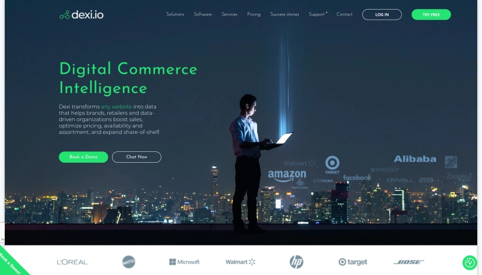

Dexi.io goes beyond simple data extraction. Data enrichment is one of its more sophisticated features, allowing you to improve retrieved data by adding additional details from other sources. This results in more insightful and complete analysis.

Additionally, you can export data scraped with Dexi.io in various formats, including CSV, Excel, or JSON. Dexi.io makes it easy to get the data you need for integration into other systems or further in-depth research.

**Pricing:** Free trial available, contact vendor for premium pricing

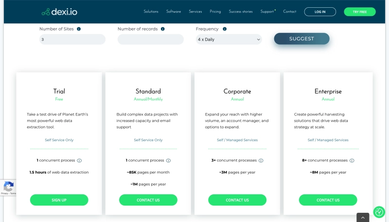

## 7. Mozenda

Mozenda is a top-tier web scraping tool offering both automated and browser-based scraping options. Mozenda's user-friendly interface and powerful features make the process of extracting data from websites much simpler.

Using its point-and-click interface, Mozenda makes navigating across websites simple. No coding knowledge? No problem. Whether you need customer reviews, product details, or any other data, Mozenda lets you quickly select the data items you want to extract.

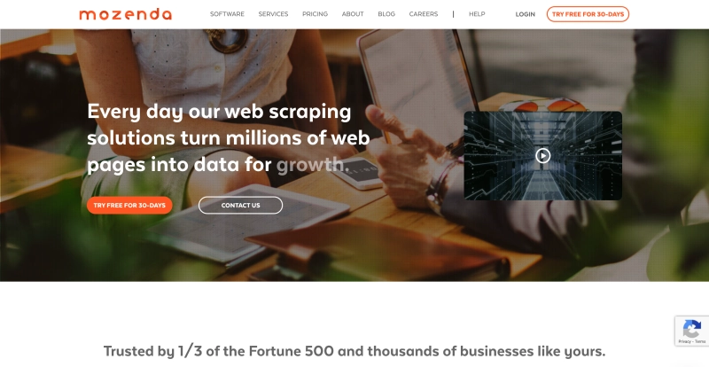

Mozenda goes beyond basic extraction. With scheduling as one of its more sophisticated features, you can automate the scraping process and extract data at specific intervals. Whether you need daily, weekly, or monthly updates, Mozenda has you covered.

Additionally, Mozenda provides seamless data export options, letting you save scraped data in multiple file types including Excel, CSV, or XML. Retrieved data can easily be included in your analytics programs or databases.

**Pricing:** Free trial available, contact vendor for premium pricing

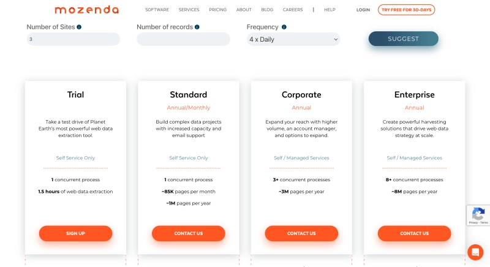

## 8. ScrapingBee

Using ScrapingBee makes collecting data from websites much easier—it's a fantastic browser-based web scraping application. With ScrapingBee's web scraping capabilities, you avoid the burden of infrastructure management.

With its intuitive API, you can effortlessly submit queries and receive scraped data. The ScrapingBee API can easily extract any type of data, including product information, news articles, and other types.

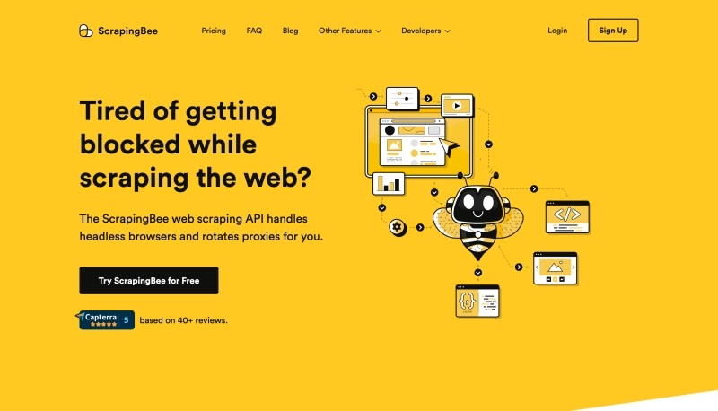

ScrapingBee goes even further. It has features that go beyond simple web scraping. It has JavaScript rendering capabilities, letting you scrape information from websites that primarily rely on JavaScript for content rendering. This ensures that even with dynamic web pages, you can access and retrieve the complete content.

Additionally, ScrapingBee handles CAPTCHAs for you, freeing you from the time-consuming work of overcoming these annoying obstacles. It automatically resolves CAPTCHAs so you can focus on acquiring the information you need. ScrapingBee also provides IP rotation to ensure the privacy of your scraping operations and prevent website blocks.

**Pricing:** Premium pricing starts at $49/month

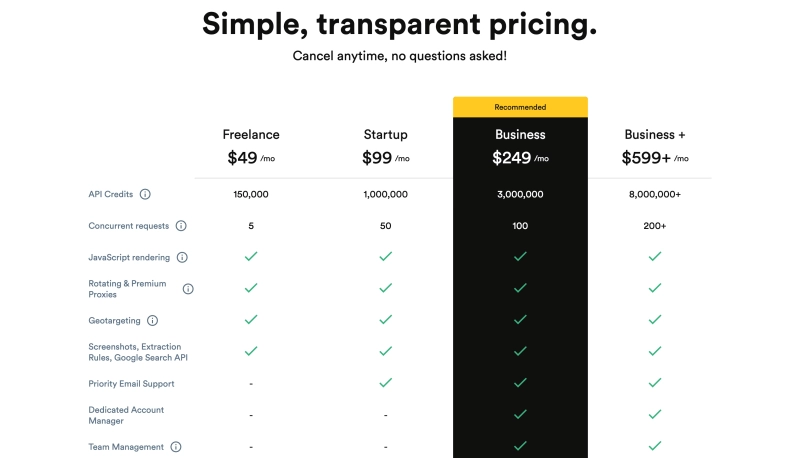

## 9. Apify

Apify is a powerful cloud-based platform that works in your browser and offers web scraping and automation capabilities. Using Apify lets you easily automate time-consuming procedures and quickly extract data from websites, giving you more time for other important work.

Without any code, you can quickly create complex scraping scenarios using Apify's visual editor. The website is easy to use, with a drag-and-drop interface that lets you directly select the data you need to scrape.

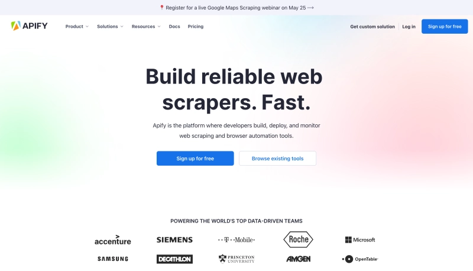

On Apify's architecture, your scraping jobs can be set up and executed as serverless services. Infrastructure and server maintenance are no longer your concern—Apify handles everything.

But what if you're not particularly skilled at scraping? No problem at all. Pre-built scraping actors can be purchased on the Apify marketplace—these are basically configured and ready-to-use scraping processes. The marketplace offers hundreds of actors for a range of websites and use cases, such as social networking platforms and e-commerce websites.

**Pricing:** Free plan available, premium pricing starts at $49/month

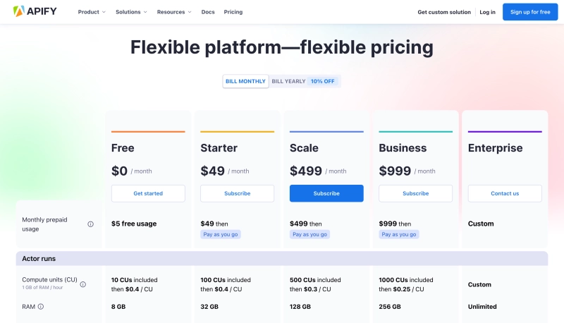

## 10. Scrapingdog

Scrapingdog is a powerful browser-based web scraping software. Without complex code or infrastructure setup, you can use Scrapingdog to quickly and effectively collect data from websites. It's like having a powerful scraper at your disposal.

Key features that make Scrapingdog stand out include its ability to simplify web scraping. The first benefit is it provides a user-friendly interface that makes navigating websites and selecting the data you need to extract simple.

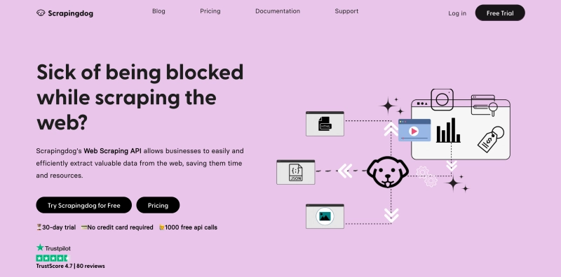

Whatever information you need to scrape—product information, news reports, or anything else—Scrapingdog meets your requirements. Second, Scrapingdog provides clever JavaScript rendering, allowing you to scrape information from websites that primarily rely on JavaScript to display content.

This ensures that even from dynamic web pages, you can access and retrieve the complete content. Additionally, Scrapingdog provides CAPTCHA handling, solving those annoying obstacles for you. It automatically answers CAPTCHAs, saving you time and effort. Plus, Scrapingdog uses IP rotation, which involves changing IP addresses to avoid websites blocking your scraping operations.

**Pricing:** Premium pricing starts at $30/month

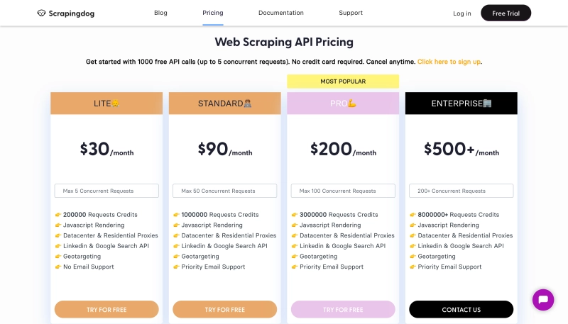

## 11. Byteline

Byteline is an excellent browser-based tool specifically created for web scraping. Without lengthy scripts or complex setup, you can use Byteline to quickly and easily extract data from websites.

It provides a user-friendly interface that lets you easily navigate websites and select the data you want to scrape. Byteline can help you acquire any type of data, including price details, customer reviews, and other information.

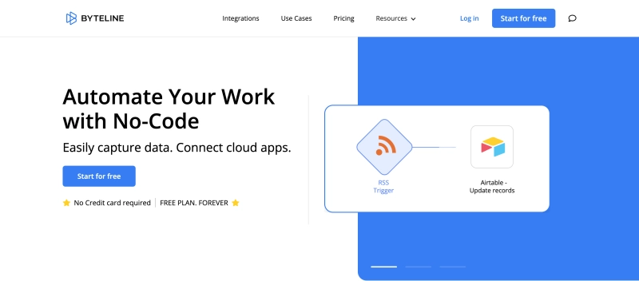

It can easily handle dynamic web pages. You can extract data from websites that rely heavily on dynamic content because it uses sophisticated methods to handle JavaScript rendering. This means you can capture and scrape the latest accessible data.

Additionally, Byteline has robust proxy and IP rotation features that let you scrape extensively without encountering any filters. It ensures your scraping operations continue unhindered and completely anonymous. Byteline also provides data export options, letting you save retrieved data in formats like CSV or Excel for additional analysis or system integration.

**Pricing:** Free plan available, premium pricing starts at $14/month

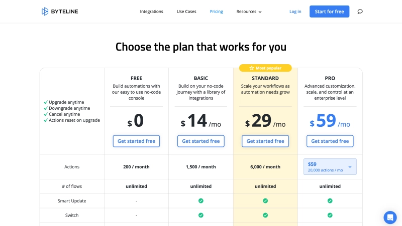

## 12. Grepsr

Grepsr is excellent web scraping software that runs within your browser. Grepsr is a useful tool for both companies and researchers because it enables you to efficiently and easily extract data from websites.

When using Grepsr, you don't have to worry about complex code or infrastructure setup. You can access and manage your scraping projects from anywhere with an internet connection because it has a cloud-based design.

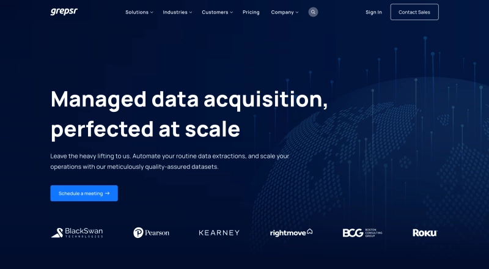

It utilizes sophisticated web scraping techniques, such as intelligent data identification and parsing algorithms, to ensure precise and reliable data extraction. Grepsr also has scheduling capabilities, enabling you to automate the scraping process and acquire updated data at predetermined intervals.

Additionally, it supports multiple data export formats such as CSV, Excel, JSON, and XML, giving you the freedom to use the data in your chosen format. You can even scrape data from the most dynamic websites because it's built to handle complex web pages, including those with JavaScript-based content rendering.

**Pricing:** Contact vendor for pricing details

## 13. ProWebScraper

ProWebScraper is a user-friendly browser-based web scraping technology that enables users to quickly and simply extract data from websites. Users can extract data using its point-and-click interface without writing any code.

Additionally, the platform has an intelligent data extraction tool that can identify and extract data from complex websites. ProWebScraper also provides custom scraping tools for websites requiring sophisticated data extraction. Extracting data from websites requiring login is one of ProWebScraper's strengths.

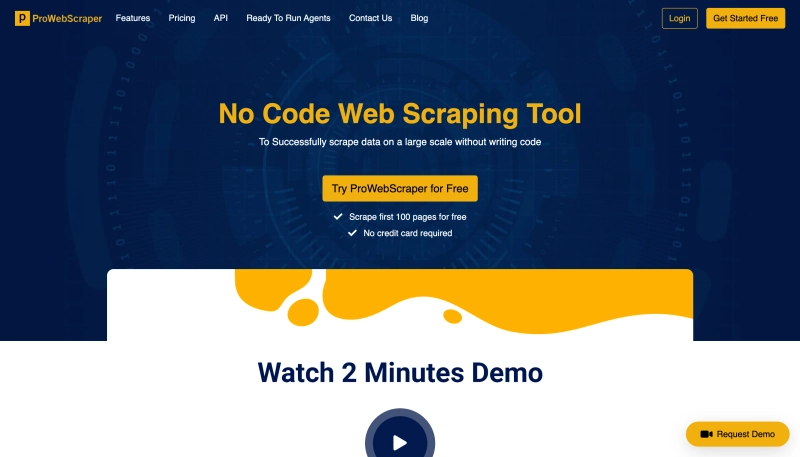

After entering login information, individuals can use the platform to scrape data from any page they have access to. ProWebScraper also provides the ability to plan and automate scraping, along with multiple export options including CSV, Excel, and JSON formats.

ProWebScraper uses web crawlers to scrape information from websites. Crawlers can navigate across multiple pages and handle complex websites. ProWebScraper further supports proxy servers, allowing users to secretly scrape data and bypass IP restrictions. The software also provides automatic data validation to ensure the accuracy of extracted data.

**Pricing:** Free plan available, premium pricing starts at $5000 for 40 credits

## 14. Scraping API

Scraping API platform is an excellent browser-based solution specifically designed to meet web scraping needs. Thanks to its user-friendly UI, you can use Scraping API to quickly and simply extract data from websites.

Whether you're a beginner or a web scraping expert, Scraping API meets your needs. With the help of modern web browser engines, it uses headless browser technology to render websites, run JavaScript, and acquire the data you need. This ensures precise and reliable scraping results, even on complex websites where material is constantly changing.

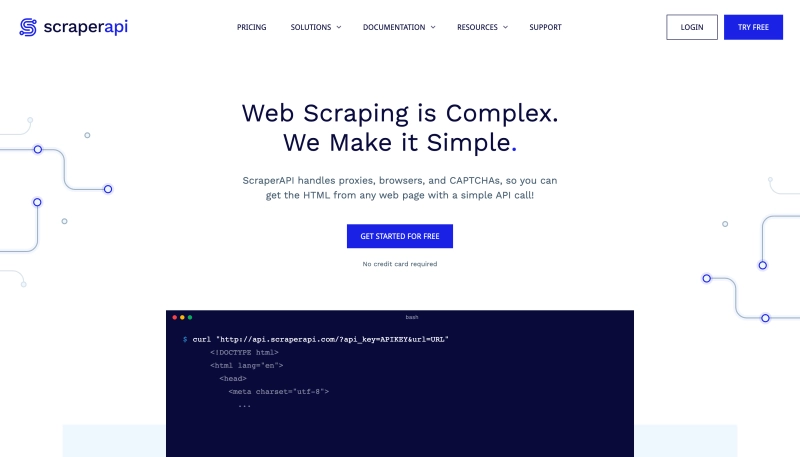

Additionally, you can use your favorite coding skills through Scraping API because it supports multiple programming languages such as Python, JavaScript, and PHP.

Thanks to its powerful features—including pagination handling, form submission, and session management—you can navigate websites and interact with them like a real user. Additionally, Scraping API provides seamless proxy rotation, enabling you to scrape web pages at scale while hiding your IP address and avoiding any bans.

To ensure accurate data extraction, the platform also provides robust error management and retry options. By using Scraping API, you can effortlessly incorporate multiple forms of data (such as HTML, JSON, and XML) into your applications or databases.

👉 [See how this API makes enterprise-level scraping accessible to everyone](https://www.scraperapi.com/?fp_ref=coupons)

**Pricing:** Premium pricing starts at $49/month

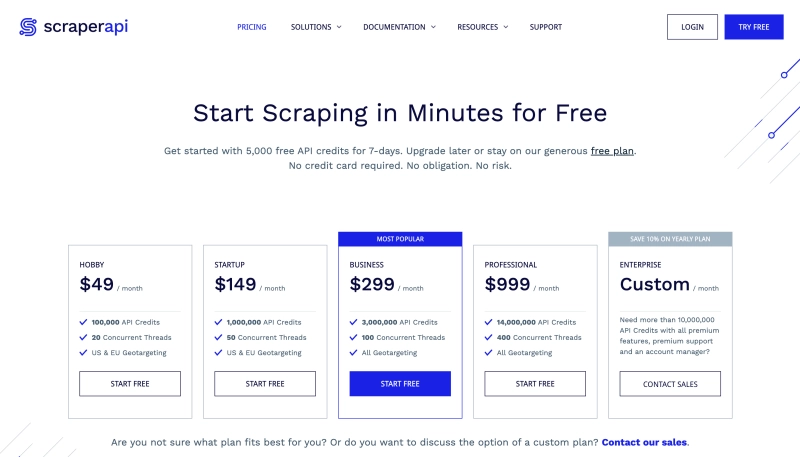

## 15. Zyte

Zyte is a browser-based platform specifically designed for web scraping. Due to its user-friendly interface, users can quickly navigate websites and retrieve useful data, eliminating the need for complex coding or infrastructure setup.

The platform adopts a headless browser strategy and leverages current web browser engines to render web pages, run JavaScript, and extract data from dynamic content. This provides precise and thorough scraping results, even from complex websites.

Additionally, Zyte offers multiple features such as sophisticated data validation, intelligent data extraction, and robust error handling methods to improve the scraping process.

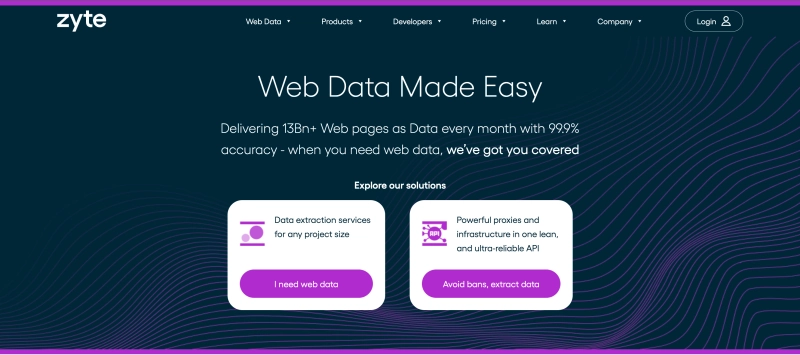

Furthermore, Zyte supports multiple code languages including Python, JavaScript, and Ruby, so users can leverage their preferred programming skills.

You don't need to manage servers or worry about Zyte's scalability because you can leverage their cloud infrastructure to easily manage and develop your scraping projects.

Additionally, Zyte has built-in proxy management features, enabling users to route their requests through various proxies to maintain anonymity and avoid IP bans. It also provides seamless interaction with various data storage formats and systems (including databases and APIs), making storing and processing collected data simple.

**Pricing:** Premium pricing starts at $450/month

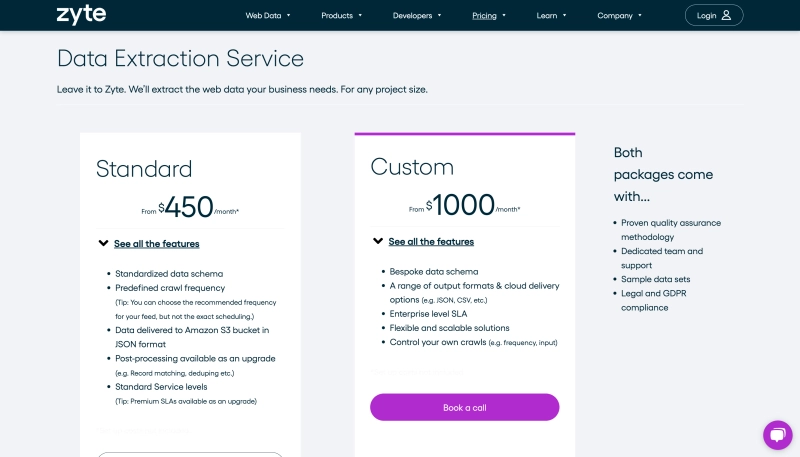

---

## Conclusion

Choosing the right web scraping platform for your unique needs is crucial for unlocking the potential of web scraping and generating data-driven insights. With so many options available, it's important to consider aspects like usability, data extraction capabilities, and API integration.

Bright Data stands out as a platform with its robust proxy network, intuitive user interface, and cutting-edge features including automated data extraction, data validation, and anti-blocking methods. Businesses can use Bright Data to easily access vast amounts of web data and leverage it to gain a competitive edge in the market.

So if you're looking for a complete and reliable web scraping solution, be sure to check out Bright Data and learn how it can help you achieve your data goals.
